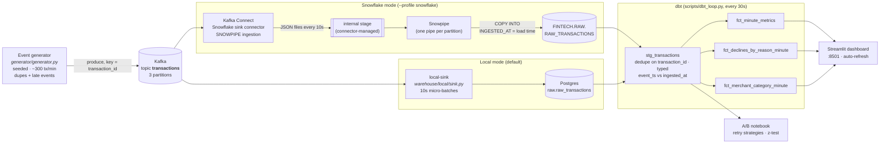
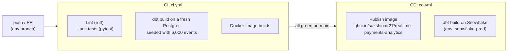

# Real-time fintech transaction analytics

[](https://github.com/sakshinair27/realtime-payments-analytics/actions/workflows/ci.yml)
[](https://github.com/sakshinair27/realtime-payments-analytics/actions/workflows/cd.yml)

Synthetic card payments stream through **Kafka** into **Snowflake** (Kafka connector → internal stage →
Snowpipe), **dbt** turns them into per-minute marts, a **Streamlit** dashboard watches them live, and a
notebook runs an **A/B test** on retry strategies for declined payments.

A local mode swaps Snowflake for Postgres, using the same landing-table shape, dbt models, dashboard, and
notebook. The whole stack runs with one `docker compose up` and no cloud account.

## Architecture



| Layer | What it does | Where |
|---|---|---|
| Generator | Seeded JSON transactions on a simulated clock: identical seed + start time ⇒ byte-identical stream. Injects ~1% duplicate sends, ~3% late events (5–90s), and a 2-min processor outage every 15 min. | [generator/generator.py](generator/generator.py) |
| Kafka | Single KRaft broker, topic `transactions` (3 partitions), idempotent producer, `acks=all`. | [docker-compose.yml](docker-compose.yml) |
| Ingestion (Snowflake) | Snowflake Kafka connector, `SNOWPIPE` method: buffers records, writes files to an internal stage, and Snowpipe `COPY`s them into `RAW_TRANSACTIONS`. | [warehouse/snowflake/](warehouse/snowflake/) |
| Ingestion (local) | Same contract into Postgres: connector-shaped `record_metadata` / `record_content`, 10s flushes, offsets committed after the load (at-least-once), table append-only via trigger. | [warehouse/local/](warehouse/local/) |
| dbt | `stg_transactions` (table, so one consistent snapshot per run): parse, cast, dedupe. Three marts (tables) bucketed on event-minute. Tests run on both warehouses. | [dbt/](dbt/) |
| Dashboard | Tx/min, approval-rate trend, declines by reason, top merchant categories, event-vs-processing lag. Reads marts only. | [dashboard/app.py](dashboard/app.py) |
| A/B notebook | Pre-registered sample size, hash-randomized split of declined transactions, simulated retry outcomes, two-proportion z-test, CI, SRM and A/A checks. | [notebooks/retry_ab_test.ipynb](notebooks/retry_ab_test.ipynb) |

### Event time vs processing time

Every row carries three clocks:

* `event_ts`: when the payment happened (payload `timestamp`). **All marts bucket on this.**
* `kafka_ts`: when the producer wrote it to Kafka (`RECORD_METADATA.CreateTime`).
* `ingested_at`: when the warehouse committed it. In Snowflake, this is a column default on the landing table.
  The connector's pipe only lists `RECORD_METADATA, RECORD_CONTENT` in its `COPY`, so `INGESTED_AT` gets the
  Snowpipe load time. Locally, Postgres `default now()` gives the batch commit time.

`stg_transactions.ingest_lag_s = ingested_at - event_ts`. The dashboard plots its average and p95 per minute.
The floor is the loader's 10s flush. Late events show up as the p95 spikes. Because marts bucket on event
time, a late event updates a minute that's already been shown. The dashboard therefore treats the newest
minute as *open* and leaves it out of the trend lines.

### Schema

```json
{"transaction_id": "0822e8f3-…", "timestamp": "2026-01-01T00:00:01.123Z", "amount": 43.13,
 "currency": "USD", "merchant_category": "grocery", "card_type": "visa",
 "status": "declined", "decline_reason": "insufficient_funds", "retry_count": 1}
```

The brief's schema plus two fields: `decline_reason`, which "declines by reason" needs (null when approved),
and `currency`, which is constant `USD` and kept for realism.

## Run it locally (no Snowflake needed)

Prereqs: Docker Desktop.

```bash
cp .env.example .env
docker compose up -d --build
```

Then open http://localhost:8501. The first numbers show up about a minute after start: loader flush, then a
dbt cycle, then the first full minute.

| Service | Role |
|---|---|
| `kafka`, `kafka-init` | broker and topic creation |
| `postgres` | local warehouse (host port **5433**) |
| `generator` | producer, 300 tx/min, seed 42 |
| `local-sink` | Kafka → `raw.raw_transactions` |
| `dbt-runner` | `dbt run` every 30s, `dbt test` every 10th cycle |
| `dashboard` | Streamlit on **8501** |

### Running pieces from the host instead

```bash
python -m venv .venv && .venv/Scripts/pip install -r requirements.txt   # bin/ on macOS/Linux
python generator/generator.py --stdout --no-realtime --count 5 --start-time 2026-01-01T00:00:00Z
cd dbt && DBT_PROFILES_DIR=. dbt build          # run + test everything
streamlit run dashboard/app.py
```

Generator flags: `--seed`, `--rate` (per minute), `--start-time`, `--count`, `--dup-rate`, `--late-rate`,
`--no-realtime`, `--stdout`. The RNG is seeded on `(seed, start-time)`. Pin `--start-time` to replay a run
exactly. Without it, each restart begins a new stream whose `transaction_id`s can't collide with earlier runs,
which dedupe would otherwise swallow.

### A/B-test notebook

```bash
python notebooks/build_notebook.py
jupyter nbconvert --to notebook --execute --inplace notebooks/retry_ab_test.ipynb
```

The notebook reads declined transactions from `stg_transactions`. The sample size is **pre-registered**:
detecting a 30% → 37% recovery lift with 80% power at α = 0.05 needs 712 per arm, so 1,424 declines. That
takes about 45–50 minutes of pipeline runtime at the default rate. The notebook analyzes exactly the first 1,424
declines in arrival order, a cohort that late events can't change. Before that point it labels the result **INTERIM**, because re-testing as data arrives
and stopping at the first p < 0.05 would inflate false positives. Assignment and outcomes are both hashed
from `transaction_id`, so a completed run is reproducible.

Result from the reference run (seed 42, 2026-10-06, first 1,424 declines):

| | A: immediate retry | B: smart backoff |
|---|---|---|
| Recovery rate | 28.9% (207/717) | **38.2%** (270/707) |
| Retries sent | 1,793 | 1,381 (−23%) |

Lift **+9.3 pts** (95% CI +4.4 to +14.2), **+32% relative**; z = 3.73, **p = 0.0002**. SRM p = 0.79; A/A
false-positive rate 5.2% over 2,000 splits. Remember the outcomes are simulated (notebook §3), so this
validates the analysis harness on real pipeline data. It isn't evidence about real issuers.

## Snowflake mode

Both technical users are `TYPE = SERVICE` with **key-pair auth only**: `KAFKA_CONNECTOR` for Snowpipe
ingestion, and `FINTECH_DBT` for dbt, the dashboard, the notebook and CD. They have no passwords, so
Snowflake's MFA requirement for password logins doesn't apply, and there's nothing to phish.

1. **Two key pairs** (git-ignored in `keys/`):
   ```bash
   openssl genrsa 2048 | openssl pkcs8 -topk8 -inform PEM -out keys/rsa_key.p8 -nocrypt
   openssl rsa -in keys/rsa_key.p8 -pubout -out keys/rsa_key.pub
   openssl genrsa 2048 | openssl pkcs8 -topk8 -inform PEM -out keys/dbt_key.p8 -nocrypt
   openssl rsa -in keys/dbt_key.p8 -pubout -out keys/dbt_key.pub
   ```
2. **Objects:** `python warehouse/snowflake/render_setup.py` writes `keys/setup_filled.sql`, which is
   [setup.sql](warehouse/snowflake/setup.sql) with both public keys filled in. Run all of it as ACCOUNTADMIN.
   It creates the roles, both service users, `FINTECH_WH` (XS, auto-suspend 60s), `FINTECH.RAW` /
   `FINTECH.ANALYTICS`, and `RAW_TRANSACTIONS` with `INGESTED_AT DEFAULT CURRENT_TIMESTAMP()`.
3. **`.env`:** set `WAREHOUSE=snowflake` and `SNOWFLAKE_ACCOUNT=<orgname-accountname>`. Everything else
   defaults correctly from `.env.example`. The `keys/` folder is mounted read-only into the containers and is
   never baked into the image.
4. **Start the stack with Kafka Connect, then register the connector:**
   ```bash
   docker compose --profile snowflake up -d
   docker compose stop local-sink
   python warehouse/snowflake/register_connector.py
   ```
   The connector creates its internal stage and one pipe per partition in `FINTECH.RAW`. Check them with
   `show pipes in schema fintech.raw;` and `copy_history` (see the bottom of `setup.sql`).
5. dbt, the dashboard and the notebook pick up `WAREHOUSE=snowflake` from `.env`, with no code changes.
   The SQL differences (VARIANT vs JSONB, timezone conversion) live in
   [dbt/macros/cross_db.sql](dbt/macros/cross_db.sql).

**Verified run (2026-10-09, AWS us-east-2, XS warehouse):**
- **Ingestion:** the connector (3 tasks, `SNOWPIPE` method) loaded about 43k rows. That's the topic's
  retained backlog plus the live stream at about 300 events/min.
- **Snowpipe:** steady-state loads land 25–40s after flush, and `INGESTED_AT` is stamped by the column default.
- **dbt:** the loop builds staging and all three marts on Snowflake every 30s, with tests passing.
  Staging dropped 404 duplicate deliveries.
- **Latency:** p95 event-to-warehouse lag fell from about 235s (backlog catch-up) to under a minute.
  That's higher than the 10s local loader, because Snowpipe batches files.
- **Cost:** while the stack runs, the dbt loop keeps the XS warehouse up at about 1 credit/hour. Stop the
  stack when you're done.

## dbt tests

| Test | Guards |
|---|---|
| `unique` / `not_null` on `stg_transactions.transaction_id` | dedupe works |
| `assert_dedupe_keeps_every_transaction` | dedupe doesn't *lose* anything: distinct ids in raw (up to staging's `ingested_at` high-water mark, since raw keeps growing) = rows in staging |
| `accepted_values` on status, card type, category, reason, currency | upstream contract |
| `assert_decline_reason_matches_status` | declined ⇔ has a reason |
| `value_between` on amount, retry_count, approval_rate | ranges |
| `unique` minute in `fct_minute_metrics`, `unique_combination_of_columns` in breakdown marts | grain |
| `relationships` breakdown → minute mart, `assert_marts_reconcile` | breakdowns sum to totals |
| `assert_ingested_after_produced` (warn) | clock sanity: processing time ≥ Kafka time |
| source `freshness` on `ingested_at` | pipeline is alive (`dbt source freshness`) |

## CI/CD

GitHub Actions, in [.github/workflows/](.github/workflows/):



| Stage | Job | Gate |
|---|---|---|
| CI | **Lint & unit tests**: `ruff`, plus `pytest` covering the generator contract and the dashboard's restart/gap handling | every push and PR |
| CI | **dbt build (Postgres)**: a throwaway Postgres service is seeded by [scripts/seed_raw.py](scripts/seed_raw.py) with connector-shaped rows, duplicates and late events included, then every model and test runs | every push and PR |
| CI | **Docker image builds** | every push and PR |
| CD | **Publish image** to GHCR, tagged `sha-<commit>` and `latest` | CI green on `main` |
| CD | **Deploy dbt to Snowflake**: tests run on the prod warehouse, and any failure fails the deploy | CI green on `main`, Snowflake secrets set |

The unit tests are regression tests for real bugs found while building this: restarts replaying
`transaction_id`s, and pipeline downtime being drawn as a volume crash.

**Snowflake deploy secrets** (Settings → Secrets and variables → Actions):
`SNOWFLAKE_ACCOUNT` (account identifier) and `SNOWFLAKE_DBT_PRIVATE_KEY` (full contents of
`keys/dbt_key.p8`). Until both exist, the deploy job passes with a "skipped" notice.

## Design notes and trade-offs

* **Dedupe in staging, not at ingest.** Raw stays an append-only record of every delivery. That keeps
  ingestion simple and replayable, and `delivery_count` keeps the duplicate rate visible.
* **Staging is a table, not a view.** Raw is appended every ~10s. Marts built a few seconds apart from a
  view would read different snapshots, and their totals would stop reconciling. `assert_marts_reconcile`
  caught exactly that.
* **Marts are full rebuilds every 30s.** At a few hundred events per minute, a rebuild is cheap and handles
  late events for free. At real volume, switch staging and marts to `incremental` with a lookback window
  (for example, reprocess the last 15 event-minutes) and move Snowflake ingestion to Snowpipe Streaming
  (`snowflake.ingestion.method=SNOWPIPE_STREAMING`) for second-level latency.
* **The A/B outcomes are simulated.** The test machinery is real: randomization, SRM, A/A calibration, z-test,
  CI, pre-registered sample size. The effect size is an assumption written down in the notebook's §3.
